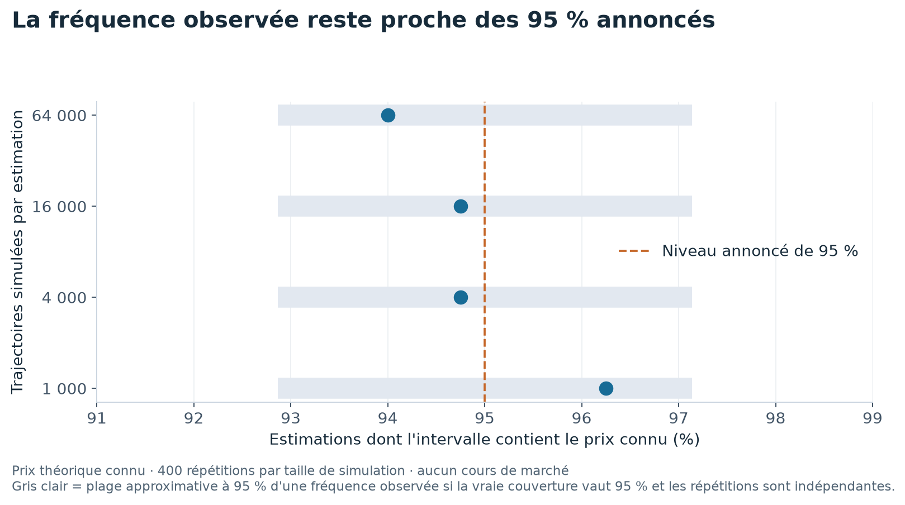

# Calculer le prix d'une option et vérifier la marge d'erreur

Une option donne le droit d'acheter ou de vendre un actif à un prix fixé, selon les dates prévues au contrat. Ce droit a un prix aujourd'hui, même si personne ne connaît le cours futur de l'actif.

Ce projet compare plusieurs façons de calculer ce prix. Il utilise des cas où une formule ou un article fournit une référence, sans données de marché.

**Une estimation n'est utile que si son prix et sa marge d'erreur résistent à des vérifications.**

## Vérifier une promesse de précision

Une simulation produit un prix estimé et un intervalle qui cherche à contenir le vrai prix. Un intervalle annoncé à 95 % devrait le contenir dans environ 95 % des répétitions indépendantes.



Chaque point vient de 400 répétitions. L'axe horizontal indique la part des intervalles qui contiennent le prix connu. Les bandes grises montrent la variabilité approximative attendue si la couverture réelle vaut 95 % et les répétitions sont indépendantes.

| Trajectoires par estimation | Intervalles contenant le prix connu |
|---|---:|
| 1 000 | 96,25 % |
| 4 000 | 94,75 % |
| 16 000 | 94,75 % |
| 64 000 | 94,00 % |

Ces écarts autour de 95 % restent compatibles avec le nombre de répétitions. [Résultats du contrôle](results/tables/couverture_ic.csv).

## Vérifier aussi les prix

Le dépôt reproduit vingt cas publiés par Longstaff et Schwartz. Il respecte leurs dates d'exercice, soit cinquante possibilités par année. Tous les prix simulés restent à moins de deux erreurs types combinées des prix simulés publiés.

Il compare aussi un arbre de prix à la formule de Black-Scholes, puis une simulation du modèle de Heston à son calcul par intégration numérique.

## Un piège mesuré

Apprendre quand exercer une option puis mesurer sa valeur sur les mêmes trajectoires donne un avantage artificiel. Ici, cette réutilisation ajoute environ 0,8 à 1,0 cent par option par rapport à des trajectoires neuves. Le dépôt mesure cet écart sur seize tirages indépendants.

Ces contrôles portent sur des modèles et des paramètres fixés. Ils ne prouvent pas que le prix calculé correspond au prix auquel une option réelle pourrait être achetée ou vendue.

## Refaire les calculs

```bash
uv sync --locked --all-extras
uv run pytest
uv run vop lab
```

Aucun téléchargement de données de marché n'est nécessaire. Le laboratoire complet inclut les répétitions statistiques et prend plusieurs minutes. Le graphique de présentation se régénère hors réseau avec `uv run python scripts/figure_presentation.py`, depuis les tableaux publiés.

## Pour aller plus loin

[Méthodes, résultats complets et références](docs/ETUDE_DETAILLEE.md) · [Présentation en PDF](rapport/rapport.pdf) · [Citer le projet](CITATION.cff) · [Licence](LICENSE).

## English summary

Option pricing methods are checked against analytic and published references. Repeated simulations test confidence-interval coverage, while independent paths reveal a small upward effect from reusing training simulations.
