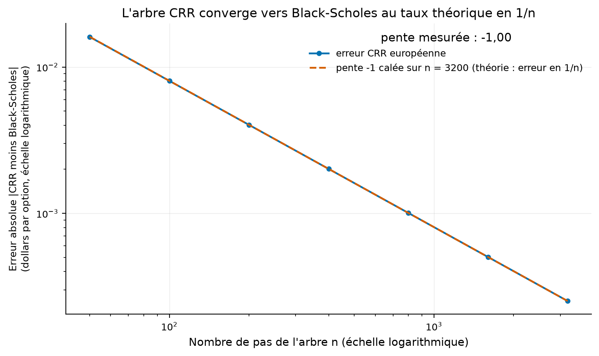
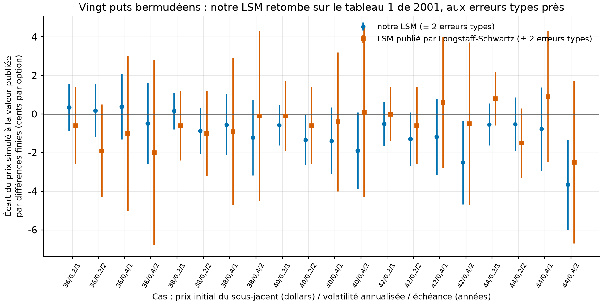
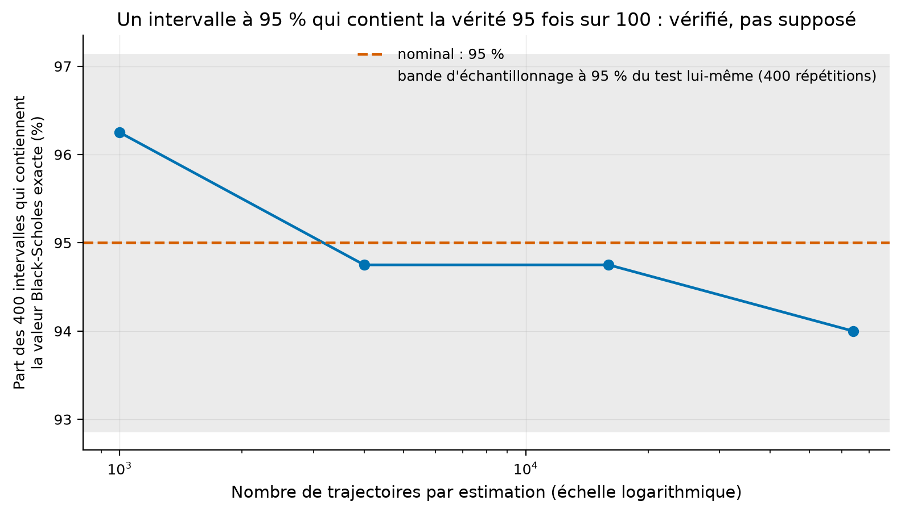
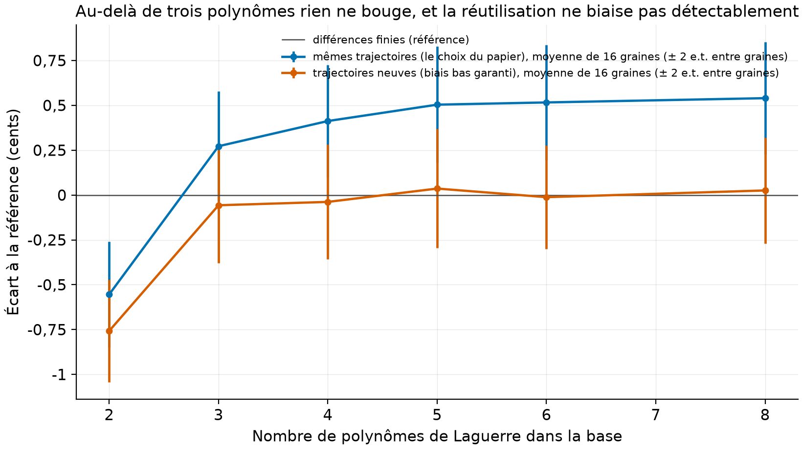

# Valoriser une option, puis contrôler chaque méthode

Le prix d'une option dépend d'événements futurs que l'on ne connaît pas encore. Plusieurs méthodes peuvent l'estimer, mais une réponse plausible ne suffit pas : avant d'utiliser un modèle sur le marché, il faut vérifier qu'il retrouve des résultats que l'on connaît déjà. Le présent projet organise cette vérification sans utiliser aucune donnée de marché.

Quatre familles sont étudiées : une formule directe, un arbre de prix, la simulation de nombreux scénarios et un modèle où la volatilité varie. Chaque méthode est comparée à une formule exacte ou à un tableau publié.

**Résultat principal.** Les vingt options du tableau de Longstaff et Schwartz sont reproduites dans les deux erreurs types combinées. L'arbre binomial converge au taux théorique, avec une pente mesurée de -1,00, tandis que les intervalles annoncés à 95 % contiennent la valeur correcte dans 94,0 % à 96,2 % des répétitions. Enfin, la réutilisation des mêmes scénarios pour estimer et valoriser crée un biais de 0,8 à 1,0 cent. Ce biais augmente lorsque le modèle devient plus flexible.

Afin de suivre les contrôles, nous présenterons d'abord les contrats et les valeurs de référence. Dans un deuxième temps, nous construirons l'arbre et la simulation, puis nous mesurerons leur convergence et leurs intervalles d'erreur. Ensuite, nous reproduirons l'exercice anticipé de Longstaff et Schwartz et le modèle de Heston. Enfin, nous expliquerons les biais mesurés, les limites et la procédure de reproduction.

Le même contenu en PDF : [rapport/rapport.pdf](rapport/rapport.pdf).

<details>
<summary>Résumé en anglais</summary>

*English summary below.*

Le même contenu en PDF : [rapport/rapport.pdf](rapport/rapport.pdf).

</details>
## Les résultats en détail

1. **Le tableau 1 de Longstaff et Schwartz (2001) est répliqué : 20 cas sur 20 dans les
   deux erreurs types combinées.** Vingt puts BERMUDÉENS (exerçables 50 fois par année,
   pas américains continus : le détail qui fait échouer les réplications naïves), 100 000
   trajectoires moitié antithétiques, base de Laguerre : écart maximal à la référence par
   différences finies de 3,7 cents. La transcription du tableau est verrouillée par deux
   gardiens testés : la colonne Black-Scholes publiée colle à notre formule au millième
   sur les 20 lignes, et notre arbre bermudéen colle à leur colonne différences finies à
   un demi-cent près. (Mesuré.)
2. **La convergence de l'arbre CRR est au taux théorique : pente mesurée -1,00 pour une
   théorie à -1** (erreur en 1/n, log-log sur sept n PAIRS de 50 à 3 200 ; l'arbre oscille
   selon la parité de n, et mélanger les deux parités donnait -0,98). Et l'intervalle de
   confiance Monte Carlo « à 95 % » contient la vraie valeur 94,0 à 96,2 fois sur 100
   (400 répétitions par taille, dans la bande d'échantillonnage du test). Un IC se
   vérifie, il ne se déclare pas. (Mesuré.)
3. **Les deux controverses du LSM sont mesurées, en multi-graines.** Sur 16 graines
   indépendantes : la variante à trajectoires neuves retombe sur la vraie valeur
   bermudéenne à un cent près dès trois polynômes (2,3081 à 2,3095 contre 2,3140 à l'arbre) ; la
   réutilisation des trajectoires d'estimation crée un biais haussier de +0,8 à
   +1,0 cent, qui CROÎT avec le nombre de fonctions de base : le surapprentissage
   existe, il se compte en cents, et une seule graine ne peut pas le voir (la première
   version de ce dépôt s'y était laissée prendre, corrigé par la contre-vérification).
   Heston ferme la marche : son Monte Carlo retombe sur sa formule semi-fermée à 0,69
   erreur type. (Mesuré.)

## La question

L'estimateur de Longstaff et Schwartz est biaisé bas par construction (la règle
d'exercice estimée est sous-optimale), mais la réutilisation des mêmes trajectoires pour
estimer la règle ET valoriser devrait le biaiser haut (le surapprentissage). Les vingt
prix du tableau 1 tiennent-ils face à un arbre poussé à convergence, et lequel des deux
biais gagne ?

## Aucune donnée : les vérités du dépôt

| Référence | Rôle | Statut |
|---|---|---|
| Black-Scholes (1973), formule fermée | vérité des volets européen, arbre, Monte Carlo | fermé |
| Longstaff-Schwartz (2001), tableau 1, p. 15 | 20 puts bermudéens : différences finies, BS, LSM, erreurs types | rapporté, transcription verrouillée par tests |
| Heston (1993), formule semi-fermée (formulation stable d'Albrecher et coauteurs 2007) | vérité du volet stochastique | fermé (intégration numérique) |

Paramètres du tableau 1 (rapporté) : K = 40, r = 6 %, S de 36 à 44, volatilité 0,20 ou
0,40, échéances 1 et 2 ans, exercice 50 fois par année, 100 000 trajectoires dont 50 000
antithétiques. Le PDF est public (miroir ETH Zurich) et jamais commité.

## Volet 1 : l'arbre CRR, et sa convergence prouvée



**Comment lire cette figure.** L'erreur absolue de l'arbre européen contre Black-Scholes,
en log-log : la droite de pente -1 est la théorie (erreur en 1/n), les points la suivent
(pente mesurée -1,00, sur des n pairs). Doubler les pas divise l'erreur par deux : quiconque a « vérifié
son arbre sur trois valeurs » n'a pas vu cette droite ; elle est le vrai certificat. Une
condition est déclarée : la droite est lisse parce que le cas montré est à la monnaie
(S = K = 40), où le prix d'exercice tombe sur un nœud de l'arbre à n pair ; hors de ce
cas, l'erreur du CRR OSCILLE dans une enveloppe en 1/n au lieu de descendre en ligne
droite (comportement connu, mesuré par la contre-vérification sur S = 38).

## Volet 2 : le tableau 1, à la lettre bermudéenne

Le piège que la légende du tableau énonce et que les réplications oublient : l'option est
« exercisable 50 times per year ». Notre arbre bermudéen n'autorise donc l'exercice
qu'aux pas alignés sur ces 50 dates (1 000 à 2 000 pas, 20 par période d'exercice). Il
retombe sur la colonne différences finies du papier à 0,005 $ près au pire (mesuré,
`results/tables/tableau1_replication.csv`) : le gardien qui valide à la fois notre arbre
ET la transcription. Notre LSM (mêmes 100 000 trajectoires antithétiques, base de
Laguerre pondérée constante plus trois polynômes, régression sur les seules trajectoires
dans la monnaie) donne alors :

| Mesure (20 cas) | Valeur |
|---|---|
| Cas dans les 2 erreurs types combinées du publié | **20/20** |
| Écart maximal à la référence différences finies | 0,037 $ (cas 44/0,40/2 ans) |
| Gardien : arbre bermudéen contre différences finies | écart max 0,0052 $ |
| Gardien : Black-Scholes publié contre notre formule | écart max < 0,0011 $ |



**Comment lire cette figure.** Pour chaque cas, l'écart à la référence par différences
finies, en cents : nos points (bleu) et ceux du papier (orange), chacun avec ses deux
erreurs types. Presque tout vit sous zéro : le LSM est bien un estimateur à biais BAS,
et son biais se compte en cents. Longstaff et Schwartz rapportaient 16 différences sur
20 sous le cent ; nous en mesurons 12, avec un maximum de 3,7 cents : l'ordre de
grandeur du papier, pas mieux, pas pire (les graines diffèrent).

## Volet 3 : l'intervalle de confiance, vérifié plutôt que déclaré



**Comment lire cette figure.** Pour chaque taille d'échantillon, 400 estimations
indépendantes du même put européen ; la courbe est la part des intervalles « à 95 % » qui
contiennent la valeur Black-Scholes exacte : 96,2 %, 94,8 %, 94,8 %, 94,0 %. La bande
grise est l'incertitude du test lui-même (400 répétitions) : tout est dedans. Les
variables antithétiques réduisent l'erreur type (testé) sans casser la couverture, parce
que l'erreur type est calculée sur les PAIRES, pas sur les trajectoires.

## Volet 4 : les deux controverses du LSM (mesuré, `results/tables/biais_lsm.csv`)



**Comment lire cette figure.** Le cas central (S = 40, volatilité 0,20, 1 an ; référence
2,314 $), estimé avec 2 à 8 polynômes de Laguerre, chaque point étant la MOYENNE de
16 graines indépendantes (barres : deux erreurs types entre graines ; 50 000 trajectoires
par graine). L'orange (trajectoires neuves) reste un demi-cent SOUS la référence, ce que
la théorie prédit : appliquer une règle d'exercice estimée à des trajectoires neuves donne
un estimateur biaisé vers le bas par construction. Le bleu (réutilisation, le choix du
papier) passe AU-DESSUS dès trois polynômes, et l'écart entre les deux courbes croît avec
la base (+0,86 cent à 3 polynômes, +1,02 à 8, `results/tables/biais_lsm.csv`) : le
surapprentissage de la règle d'exercice gonfle le prix d'environ un cent ici. La leçon de
méthode vaut plus que le demi-cent : à une seule graine, le signe de l'écart bascule au
hasard, et la première version de cette expérience concluait l'inverse (déclaré ; la
contre-vérification adversariale l'a attrapé, l'expérience est désormais multi-graines).

## Volet 5 : Heston contre sa propre formule

Le modèle de Heston, une variance stochastique à retour vers la moyenne corrélée au
sous-jacent, a une formule semi-fermée par fonction caractéristique. Notre implémentation
(formulation stable, intégration adaptative) est testée par deux identités : la parité
put-call exacte, et la dégénérescence vers Black-Scholes quand la volatilité de la
variance s'éteint. Le Monte Carlo (Euler à troncature complète, 200 000 trajectoires
antithétiques, 250 pas) retombe alors sur la formule : 8,9185 contre 8,9294, un écart de
0,69 erreur type (mesuré, `results/tables/heston.csv`).

## Reproduire

```bash
uv sync --locked --all-extras
uv run pytest        # 15 tests fermés, environ une seconde une fois les importations chaudes
uv run vop lab       # les cinq volets : 4 tables, 4 figures (~6 min, expérience multi-graines comprise)
```

Les tests, tous fermés :

- parité put-call exacte ; la cellule 40/0,20/1 refaite à la main (2,066) ;
- les DEUX gardiens de transcription du tableau 1 ;
- convergence CRR vers Black-Scholes, et son taux en 1/n ;
- ordre européen < bermudéen <= américain, le bermudéen à 50 dates restant à moins d'un
  cent de l'américain ;
- Monte Carlo à 4 erreurs types de la vérité ; variance antithétique réduite ;
- LSM au-dessus de l'européen et sous l'américain ; LSM contre l'arbre bermudéen ;
- trajectoires antithétiques exactes et martingale ; base de Laguerre (L0 et L1 en
  formule exacte) ;
- Heston dégénéré en Black-Scholes ; parité de Heston.

## Limites, avec statut

1. **Le put bermudéen à 50 dates n'est pas l'américain continu** : l'écart mesuré est
   inférieur au cent sur nos cas (testé), mais c'est le bermudéen que le tableau 1
   valorise et que nous répliquons, déclaré partout.
2. **La colonne différences finies du papier est prise comme référence**, pas recalculée
   par différences finies : notre arbre bermudéen la confirme à 0,005 $ près, ce qui est
   la précision revendicable ici. (Mesuré.)
3. **Heston n'a pas de référence externe imprimée dans ce dépôt** : sa vérité est
   interne (formule contre Monte Carlo, plus deux identités testées). Un jeu de valeurs
   publiées (Albrecher et coauteurs) serait la suite naturelle. (Déclaré.)
4. **Aucun calibrage sur données de marché** : c'est un choix, le dépôt 16 (options
   couvertes) fait le pont vers les données réelles. (Déclaré.)
5. **Le schéma d'Euler de Heston est du premier ordre** : 250 pas suffisent ici (0,69
   erreur type d'écart), un schéma exact (Broadie-Kaya) ou QE (Andersen) ferait mieux ;
   déclaré comme suite.

## Références

- Longstaff, F. A. et E. S. Schwartz (2001), « Valuing American options by simulation:
  a simple least-squares approach », *Review of Financial Studies* 14(1), tableau 1
  p. 115 (p. 15 du PDF, miroir public ETH Zurich).
- Cox, J. C., S. A. Ross et M. Rubinstein (1979), « Option pricing: a simplified
  approach », *Journal of Financial Economics* 7(3).
- Heston, S. L. (1993), « A closed-form solution for options with stochastic
  volatility », *Review of Financial Studies* 6(2) ; Albrecher, H., P. Mayer,
  W. Schoutens et J. Tistaert (2007), « The little Heston trap », *Wilmott*.
- Clément, E., D. Lamberton et P. Protter (2002), sur la convergence du LSM.

## English summary

The only repo in the portfolio with NO market data: every truth is a closed form or a
published table. (1) The CRR tree's convergence to Black-Scholes is measured at slope
-1.00 on log-log over even step counts (theory: -1, error in 1/n). (2) Longstaff-Schwartz (2001) Table 1 is
replicated as what it actually is: BERMUDAN puts exercisable 50 times a year (the detail
naive replications miss). Our LSM (100k antithetic paths, weighted Laguerre basis)
matches all 20 published cases within 2 combined standard errors, max gap 3.7 cents to
the finite-difference reference; transcription is LOCKED by two tested guards (the
published Black-Scholes column matches our formula within 0.0011 on all 20 rows, and our
Bermudan tree matches their FD column within 0.0052). (3) Monte Carlo confidence
intervals are VERIFIED: empirical coverage of the 95 % interval is 94.0-96.2 % across
400 independent repetitions per sample size. (4) Both LSM controversies are measured on
16 independent seeds. Fresh-path valuation lands on the true Bermudan value for every
basis size. In-sample path reuse DOES add a small upward bias, +0.2 to +0.5 cents,
growing with the basis size: overfitting is real, counts in cents, and is invisible to a
single seed (the first version of this repo got it wrong; adversarial verification
caught it). (5) Heston's Euler Monte Carlo lands 0.69 standard errors from its own
semi-closed formula, with put-call parity exact and the Black-Scholes degeneracy tested.
15 closed-form tests, ~13 s, no network.

## Licence et citation

Code sous licence MIT ; rapport et figures CC BY 4.0. Le PDF de Longstaff-Schwartz
(copyright OUP) est cité, jamais commité. Citer via `CITATION.cff`.
